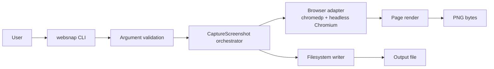
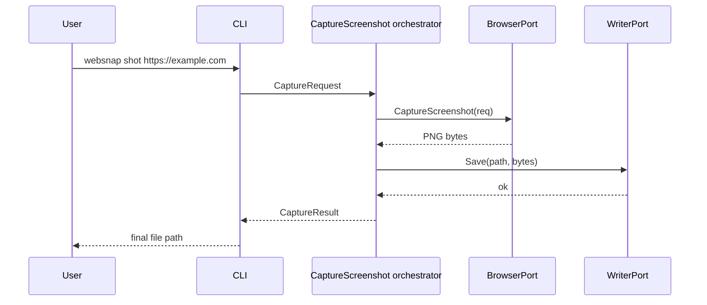

# Proposed architecture for websnap

## 1. Context

`websnap` is a Go CLI focused on **reproducible web UI screenshots**.

The bootstrap already implements the first screenshot path, but the architecture is still intentionally small and evolving.

The goal is not to compete with full testing suites or media editors.  
The goal is to solve one specific need well:

> request a capture from the terminal, get a predictable file, and keep a clean foundation for future growth.

---

## 2. Foundational question: how can a terminal tool capture a web page?

The terminal does not render HTML, CSS, or JavaScript.  
The CLI acts as an **orchestrator** for a headless browser.



### Logical flow

1. The user invokes `websnap shot <url>`.
2. The CLI transforms flags into a `CaptureRequest`.
3. The orchestrator validates intent and coordinates capture.
4. A `chromedp` adapter opens headless Chromium and renders the page.
5. The browser produces image bytes.
6. A writer persists the artifact and returns the final path.

---

## 3. Architectural goals

- keep the CLI simple for users
- isolate browser technology from the core orchestration
- keep the domain small and explicit
- allow growth toward selector, clip, GIF, and i18n without breaking the main path
- favor maintainability over cleverness

---

## 4. Non-goals for the first stage

- do not design a general-purpose automation engine yet
- do not couple the tool to CI providers or external services
- do not introduce global configuration too early
- do not mix screenshot and GIF into the same base orchestrator
- do not treat documentation translation as product i18n

---

## 5. Core decisions

### ADR-001 — Choose Go

**Decision:** use Go as the primary language.

**Why:**

- distributable binary
- excellent fit for CLI tooling
- low operational friction
- strong balance between simplicity and structure

**Alternative considered:** Node.js + Playwright  
**Why not in this phase:** it speeds up prototyping, but it complicates packaging and runtime expectations for a tool that aims to behave like a system binary.

---

### ADR-002 — Start with `chromedp`

**Decision:** use `chromedp` as the browser adapter for the initial screenshot path.

**Why:**

- natural integration with Go
- strong fit for headless screenshot capture
- lower conceptual overhead for V1

**Alternative considered:** Playwright  
**Why not as the first choice:** it is excellent for richer automation, but it introduces more moving parts than the first release needs.

---

### ADR-003 — Defer GIF

**Decision:** keep GIF out of the first implementation path.

**Why:**

Because GIF is a different problem:

- frame sequencing
- temporal control
- encoding
- extra dependency management

If it enters too early, the screenshot path gets polluted from day one.

---

### ADR-004 — Keep English-first docs, add CLI i18n later

**Decision:** keep documentation in English first, while planning localized CLI messages for a later version.

**Why:**

- English-first docs are better for broader reach and interview presentation
- runtime i18n belongs to the product surface, not to repository prose
- localization becomes cleaner when errors and help text are already structured

**Rule:** domain and orchestrator layers should expose error codes or typed failures; the CLI layer maps those to localized strings later.

---

## 6. Proposed code structure

```text
cmd/
  websnap/
    main.go

internal/
  cli/
    root.go
    shot.go

  domain/
    capture_request.go
    capture_result.go

  orchestrator/
    capture_screenshot.go

  port/
    browser.go
    writer.go

  adapter/
    browser/
      chromedp/
        browser.go
    writer/
      filesystem/
        writer.go

  support/
    errors/

docs/
  README.md
  ARCHITECTURE.md
  FEATURES.md
```

Future additions such as `internal/i18n/` should appear only when `v1.1.0` actually starts.

### Why this structure

Because it cleanly separates:

- **entry point** (`cli`)
- **business intent** (`domain`)
- **coordination** (`orchestrator`)
- **ports** (`port`)
- **technical details** (`adapter`)

That makes it possible to change browser tooling or output persistence without rewriting the main contract.

---

## 7. Minimum conceptual model

### `CaptureRequest`

Represents user intent:

- URL
- width
- height
- output path
- capture mode
- optional selector
- future behavioral flags

### `CaptureResult`

Represents the business result:

- final file path
- resolved dimensions
- basic capture metadata

---

## 8. Primary ports

The orchestrator should depend on interfaces, not on `chromedp` directly.

```go
type BrowserPort interface {
    CaptureScreenshot(ctx context.Context, req CaptureRequest) ([]byte, error)
}

type WriterPort interface {
    Save(ctx context.Context, path string, data []byte) error
}
```

There is no reason to overdesign beyond this at the start.  
The point is not to create twenty interfaces; the point is to isolate two real dependencies:

1. browser execution
2. filesystem persistence

---

## 9. `shot` execution sequence



---

## 10. Error-handling expectations

Failures must be understandable. Examples:

- invalid URL
- browser not available
- page load timeout
- selector not found
- output path not writable

### Rule

Errors should bubble up with context.  
No meaningless “failed” messages.

### i18n implication

If the product will be localized later, the CLI should map **error codes** or **typed failures** to message catalogs instead of hard-coding English or Spanish deep in the orchestrator or domain layer.

---

## 11. Localization strategy

Localization should happen at the **presentation boundary**, not inside the domain.

### Initial phase

- English help text
- English user-facing messages
- English docs

### Advanced phase

- `en` and `es` message catalogs
- locale-aware help output
- locale-aware feedback and errors
- English fallback when a translation is missing

This keeps product i18n intentional instead of becoming string-copy chaos.

---

## 12. Evolution strategy

### First

Stabilize the path:

`CLI -> CaptureScreenshot orchestrator -> BrowserPort -> WriterPort`

### Then

Add features without breaking the foundation:

- selector
- full-page
- delay
- clip

### Much later

Add a separate GIF pipeline:

- `FrameCapturePort`
- `EncoderPort`
- FFmpeg integration

That deserves its own orchestrator. It should not hang off `shot` as a patch.

---

## 13. Risks and mitigations

| Risk | Impact | Mitigation |
| --- | --- | --- |
| Chromium/headless dependency | The CLI cannot capture | Detect prerequisites and fail with a clear message |
| DOM timing instability | Unreliable captures | Introduce `--delay` and controlled timeouts in later versions |
| Cross-platform path differences | Write failures | Centralize path construction |
| Screenshot/GIF mixing too early | Inflated architecture | Keep separate roadmap and execution paths |
| Localized strings hard-coded too early | Messy future i18n | Use codes/typed errors and map them in the CLI layer |

---

## 14. Why this architecture is interview-defensible

Because it shows judgment, not just enthusiasm:

- intentionally reduced scope
- meaningful separation of layers
- explicit orchestrator layer
- justified technology choice
- controlled growth by version
- clear distinction between V1 and backlog
- explicit localization strategy instead of string chaos

That is architecture.  
Everything else, if left uncontrolled, is just excitement pretending to be design.
