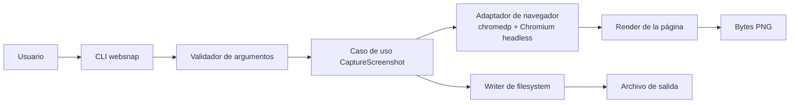
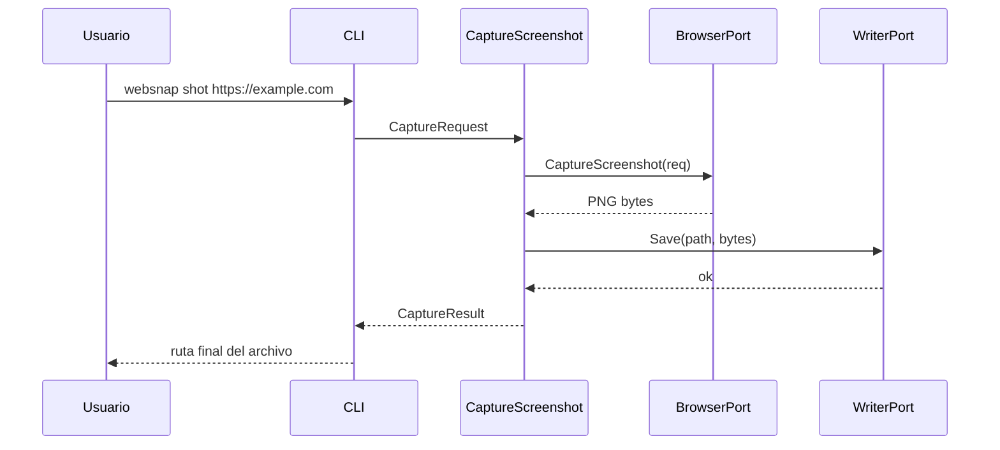

# Arquitectura propuesta de websnap

## 1. Contexto

`websnap` se plantea como una CLI en Go enfocada en **capturas reproducibles de interfaces web**.

La meta no es competir con suites completas de testing ni con editores multimedia.  
La meta es resolver bien una necesidad específica:

> pedir una captura desde terminal, obtener un archivo predecible y dejar una base limpia para crecer.

---

## 2. Pregunta base: ¿cómo una herramienta de terminal captura una web?

La terminal no renderiza HTML, CSS ni JavaScript.  
La CLI actúa como **orquestador** de un navegador headless.



### Flujo lógico

1. El usuario invoca `websnap shot <url>`.
2. La capa CLI transforma flags en un `CaptureRequest`.
3. El caso de uso valida la intención y decide cómo capturar.
4. Un adaptador `chromedp` abre Chromium headless y renderiza la URL.
5. El navegador produce la imagen.
6. Un writer persiste el resultado y devuelve la ruta final.

---

## 3. Objetivos arquitectónicos

- **CLI simple** para el usuario
- **aislar la tecnología del navegador**
- **mantener el dominio pequeño y explícito**
- **permitir crecer a selector, clip y GIF sin romper la ruta principal**
- **favorecer mantenibilidad sobre trucos**

---

## 4. No objetivos arquitectónicos para la primera etapa

- no diseñar todavía un motor de automatización genérico
- no acoplar la herramienta a CI o servicios externos
- no introducir configuración global desde el inicio
- no mezclar screenshot y GIF en el mismo caso de uso base

---

## 5. Decisiones base

### ADR-001 — Elegir Go

**Decisión:** usar Go como lenguaje principal.

**Por qué:**

- binario distribuible
- gran fit para CLI
- baja fricción operativa
- buen equilibrio entre simplicidad y estructura

**Alternativa considerada:** Node.js + Playwright  
**Por qué no en esta etapa:** acelera prototipado, pero complica más la distribución y el runtime para una herramienta que quiere comportarse como binario de sistema.

---

### ADR-002 — Empezar con `chromedp`

**Decisión:** usar `chromedp` como adaptador de navegador para la ruta de screenshot inicial.

**Por qué:**

- integración natural con Go
- buena base para screenshot headless
- menor complejidad conceptual para V1

**Alternativa considerada:** Playwright  
**Por qué no como primera elección:** es excelente para automatización rica, pero para una primera CLI enfocada en captura introduce más piezas de las necesarias.

---

### ADR-003 — Diferir GIF

**Decisión:** no meter GIF en la primera ruta de implementación.

**Por qué:**

Porque GIF es otro problema:

- secuencia de frames
- control temporal
- encoding
- dependencia de FFmpeg u otro encoder

Si se mezcla demasiado pronto con `shot`, el diseño nace contaminado.

---

## 6. Estructura propuesta del código

```text
cmd/
  websnap/
    main.go

internal/
  cli/
    root.go
    shot.go

  domain/
    capture_request.go
    capture_result.go
    output_path.go

  usecase/
    capture_screenshot.go

  port/
    browser.go
    writer.go
    clock.go

  adapter/
    browser/
      chromedp/
        browser.go
    writer/
      filesystem/
        writer.go
    clock/
      system/
        clock.go

  support/
    validate/
    naming/
    errors/

docs/
  README.md
  ARCHITECTURE.md
  FEATURES.md
```

### Por qué esta estructura

Porque separa claramente:

- **entrada** (`cli`)
- **intención del negocio** (`domain`, `usecase`)
- **puertos** (`port`)
- **detalles técnicos** (`adapter`)

Eso permite cambiar el motor de navegador o la estrategia de salida sin reescribir el contrato principal.

---

## 7. Modelo conceptual mínimo

### `CaptureRequest`

Representa la intención del usuario:

- URL
- ancho
- alto
- ruta de salida
- modo de captura
- selector opcional
- flags de comportamiento futuras

### `CaptureResult`

Representa el resultado de negocio:

- ruta final del archivo
- dimensiones resueltas
- metadatos básicos de la captura

---

## 8. Puertos principales

La idea es que el caso de uso dependa de interfaces, no de `chromedp` directamente.

```go
type BrowserPort interface {
    CaptureScreenshot(ctx context.Context, req CaptureRequest) ([]byte, error)
}

type WriterPort interface {
    Save(ctx context.Context, path string, data []byte) error
}
```

No hace falta sobrediseñar más en esta etapa.  
El punto no es crear veinte interfaces; el punto es **aislar dos dependencias reales**:

1. navegador
2. filesystem

---

## 9. Secuencia del caso de uso `shot`



---

## 10. Manejo de errores esperado

La herramienta debe fallar de forma entendible. Ejemplos:

- URL inválida
- navegador no disponible
- timeout de carga
- selector inexistente
- ruta de salida no escribible

### Regla

Los errores deben subir con contexto.  
Nada de mensajes genéricos tipo “failed”.

---

## 11. Estrategia de evolución

### Primero

Consolidar la ruta:

`CLI -> CaptureScreenshot -> BrowserPort -> WriterPort`

### Después

Agregar capacidades sin romper la base:

- selector
- full-page
- delay
- clip

### Mucho después

Agregar un pipeline separado para GIF:

- `FrameCapturePort`
- `EncoderPort`
- integración FFmpeg

Eso merece su propio caso de uso. NO debe colgarse de `shot` como parche.

---

## 12. Riesgos y mitigaciones

| Riesgo | Impacto | Mitigación |
| --- | --- | --- |
| Dependencia de Chromium/headless | La CLI no puede capturar | Detectar prerequisitos y fallar con mensaje claro |
| Timing inconsistente del DOM | Capturas inestables | Introducir `--delay` y timeouts controlados en versiones siguientes |
| Paths distintos por SO | Errores de escritura | Centralizar construcción de rutas |
| Mezclar screenshot y GIF muy pronto | Arquitectura inflada | Separar roadmap y pipelines |

---

## 13. Qué hace esta arquitectura defendible en una entrevista

Porque muestra criterio, no solo ganas de codificar:

- alcance reducido con intención
- separación de capas con sentido práctico
- elección tecnológica justificada
- crecimiento controlado por versiones
- distinción clara entre V1 y backlog

Eso es arquitectura.  
Lo demás, si no se controla, es entusiasmo disfrazado de diseño.
